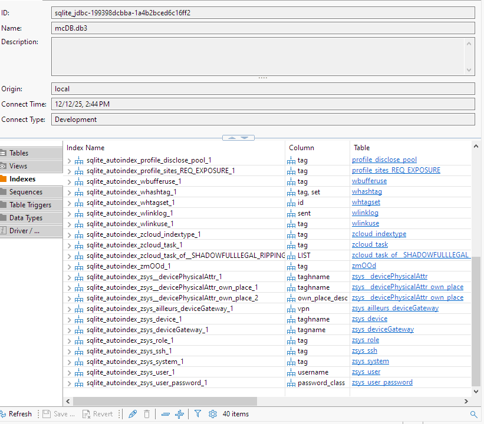
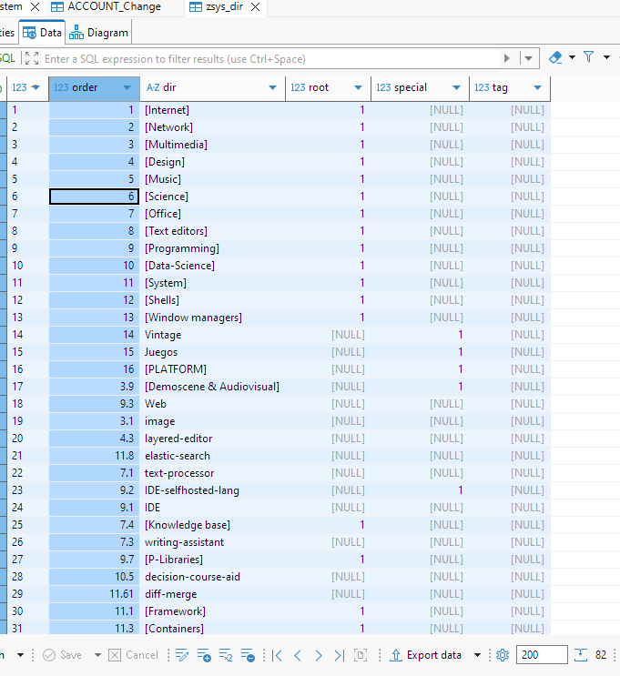
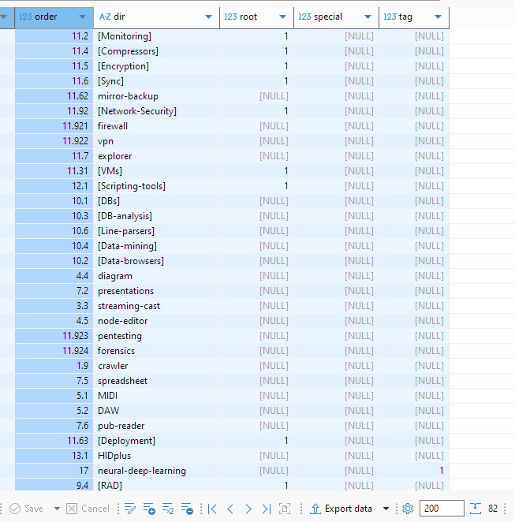
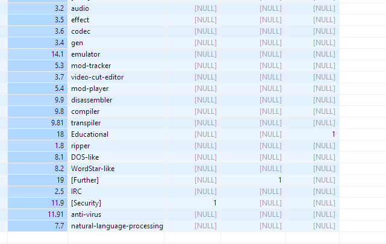
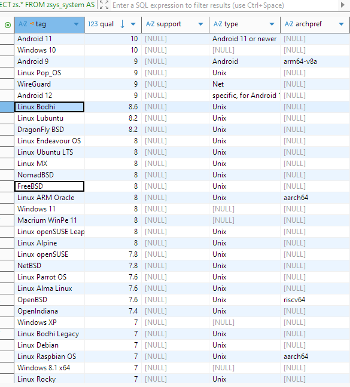

# MindColumn_backend_crm_db_public
Parts of the MindColumn db made public under permissive license

UPDATED 2025-11-14T20:25:05Z ***Full documentation available***\
UPDATED 2025-12-12T14:32:25Z ***RC - Schema almost frozen, size:107*** is almost done, few minor quirks and _we go directly to the next Produce_ (next repo, phase)\
**demo binaries are available**, just go to https://sqliteonline.com/ and open `https://github.com/ceres707/MindColumn_backend_crm_db_public/raw/refs/heads/main/bin/mcDBout.db3`

**State of the art: NONE of this model is to be validated —it can be said passed way beyond beta stage a couple of years—, so is _field tested_, and proved convenient for almost 2 years now since the starting of de design in 2023.  
Meaning  
the orthodox normalization is not a goal; Expandability, versatility and pragmatism is. Also avoiding using something too specific to _SQLite_ so It can be translated and deployed easily to other databases.**  
There are reasons for each little _de-normalization_, explained later.

_Extra logic is sold separately_ in clients written and being polished in Express/Vue.js, Ruby, Lazarus, LUA, for now —each part for what is convenient. Type of license of those projects is not decided, if even released. But you already can expand, adapt, and make money from this if considered a good idea.

"We put things into our system like systems management that's not that much fun for university developers," (Bill Gates, long ago)
like this `:)`

"Linux doesn't have that stuff. It doesn't have the graphics interface. It doesn't have the rich set of device drivers. So certainly we think of it as a competitor in the student and hobbyist market. But I really don't think in the commercial market, we'll see it --compete with Windows-- in any significant way." (Bill Gates, long ago)

歌え 歌え 世界中へ
⾳⾊は⾵を切って どこまででも
⽻ばたく (誓いのWingbeat, Morfonica)

### Aims are / already used for:

* Strategic reach of deployments
* Full purview of publications control for SMEs, feedback and marketing control
* Enquiries  and level of compliance and affinities for peers and _senpai_ circles
---
* Home and SMEs Accruals strategic control and cash flow
* Funds and prepaid assets
* Bookmarked expenses journal
---
* Wit and / or formal communication facilities (AI-guided style)
* Bundled themes for branding
* Niche POIs research. Places and entities tracking
* Social media links, snippets and presentations cards
* Deployment of profiles, servers and geographical
* Gaming deployment, yes gaming is a thing, even more for philosophically salient ones
---
* Profile account history and terms compliances
* Keyword alerts, branding and found
* EPUB landings, milestones and publishers, submission tracking
* Posting and distribution signal (old AI-frames style), feedback and reinforcement control
* Branding control based on regular expressions
---
* AV production standards tracking, levelling, VSTs
* Modus operandi subsets
* Multimedia capture standards per resource
* Resources for artistic Reasons (ingest reason, salience) springboarding
* Philosophical type of multimedia elements
* Hardcore media tracking: series, use, author, deployment, licenses
* Media quick-info ingest, never miss anything. Curation queue
---
* Device control, physical, location
* Devices backup, roles assigned, OSes, audit software
* Devices with gateways allowed for current and vintage (leisure)
* Control of devices as auth. entities, SSH, and usernames
* Third party software package tracking and quick-deploy generation
* Diverse architecture testing and capability tracking
---
* Interest, and scene seeking —some may say this is anti-algorithm, but it's yours
* Eventual strategic overbooking
* Used assets, calculated and backed terms of used (legal backing)
---
* Random covering scheduler for easy full-maintenance

Soon we'll push the model and usage guidelines
stay tuned...

UPDATED 2025-11-14T20:25:05Z

Here are our expanded vision to regain control of your _personal_ computer.\
\
Model is **completed**, it's going to take a couple of days or weeks to be fully available here, since I have to submit it to the French network as a proof of origin rather accompanied with another stuff of various tangential fields that we are finishing in a single bow (2025-11-13T13:47:21Z).\

\
All model is auto-explicative, meaning a study has been made to detect if every single concept is unambiguous, the following is just the complementary to that fact:\
\
`ACCOUNT_Accruals/`\
&emsp;`months_agoOffset` _0_ (start using), _1_ (past due), _2_ (one month margin) …\
&emsp;a month has `30.4375` days, a year is `365.25`days.\
\
`ACCOUNT_Card/`\
&emsp;This is critical and for reference only. For now you might not want to fill all the columns, or develop a cipher mechanism.\
&emsp;`expiration`: All dates in the model are Zulu ≈ UTC+0 coordinated. For legacy reasons de suffix Z appears, maybe is not all good and have to be fixed for `ISO8601` compliance. Even months may have Z suffix.\
&emsp;The ISM: _SQLite does not have a storage class set aside for storing dates and/or times. Instead, the built-in Date And Time Functions of SQLite are capable of storing dates and times as TEXT, REAL, or INTEGER values_\
\
`banter` and `bundle` can be _pipe_ that is, review material to summarize and generate valuable new content.\
`banter` is mostly for POSTing assuring the profile used for posting correspond with this.\
`bundle` is referenced in various places for theoretical to practical compliance in a sounding check.\
\
`cPlace` and `cPOI` both externally use String ids of 4 (chars and numbers), great for disk filesystem compliance.\
\
`cNiche` tags *can contain versioning*, in this way SEMANTICALLY can be seen as past perfect used set, for example dossier sent during a whole epoch — ありがとうございま**した**。\
\
`cPOIlinks` is for non-tied platform communication, as for the following `SM_strat`. We want to converge the ideal with the factual, so this outline.\
\
`ESwivl_profile_deploy/`\
&emsp;`victoriaCROWNEDpigeon` is a large, bluish-grey pigeon with elegant blue lace-like crests, maroon breast and red irises _(source: Wikipedia)_.\
&emsp;`reach` is a relaxed exception regarding datatypes, application must observe a foreign constraint. Other databases like _QuestDB_ see this as a _symbol_\
&emsp;`bis1` is a small convergence pick list that merges two worlds, one theoretical _strat_ another factual, have been used successfully.\
&emsp;`elm` is a description of the deployment environment (convergent speech redundant, we'll see why).\
\
`ESwivl_reach/`\
&emsp;`type` is flexible.\
&emsp;`subSET_desc`: We reached a point where is convenient to deploy a subset, and all the descriptor is not needed, use this column where is not considered a full deployment descriptor.\
\
`etype` is used for cataloguing of media and internet links that also can be _pipe_, for further creation and/or investigation.\
&emsp;_EXAMPLES: "Greetings" like celebration of life, "Buying temp" like opportunities, "Personal Vision" like your horizon, "Chi Sao" like in Aristotle's fond of assertions investigation, "Political Philosophical Shock" (for whoever likes it. =/ ), "Editorial", "Witty", "Lifestyle"; is up to the user_\
\
`media/`\
&emsp;`file`: have to be found on disk, route is inferred, from `muse` and others.\
&emsp;`array`: when we have a set of media, name of sets is inferred for each one. _1_ is the same as _NULL_, _2_ is the minimum set.\
&emsp;`bundle` is for de-normalized matching cohesion with other related tables like the profile associated.\
&emsp;`wlink` also have to be paired with plain `link` somehow, de-normalized concessio, good for convergence.\
&emsp;And then the museum zone, where `*_LANG` is the primary speaking language of the user, if applicable.\
&emsp;`terms`facilitate legal imprints and control of the media.\
\
`media_quickinfo` is a resumed version for rapid notes, the aims are — this to be void. so `file` here is not inferred, full qualified.\
\
`mopSET` are _modus operandi_ sets based on specific types of `wlink` of `wlinkuse` as _"modusop"_.\
\
`mtheme`are themes of interest besides the project or self-development, that enriches the whole, are pointed by `wlink` i.e.: external links. Multimedia theme cataloguing is by the referred `wlink`, or other multimedia parameters already reviewed.\
\
`page/`\
&emsp;`disclose_code` is an invitation card for specific domains, apps.\
\
`page_links/` \
&emsp;`type` can be labels, no strict use is developed for this.\
&emsp;`link` is the shortened one.\
\
`pcritic_landing` are classical landing pages of a certain type. That types goes a little far beyond what is considered a landing page, **key-points to be watched**.\
\
`posting/`\
&emsp;Are _tounroll_by_pageref_ and _spreadable_by_purview_; more on this on best practices.\
&emsp;`profile`s have to match `PURVIEW`'s that was introduced later to enhance the capability of vision and reach of the postings.\
&emsp;Then is classical content. Content contains DSL language expression for versatility like `##PV##`, developed separately.\
&emsp;Post content decomposing, orthodox ways and linking are still working perfectly today.\
&emsp; **-- control --**\
&emsp;`sent` column, `n` and `removed` for control\
&emsp;**-- and then the parameters engine --**\
&emsp;`*pv`: purview strict closed media; `*xulr/n`: url /n is multivalued (`\n` separated), for random multi-posting (`n`) and options\
&emsp;_One can review returning patterns of column usage for the above, depending on Purview or even banter. that's Intrinsic to its good usage_\
&emsp;**-- and we finish with Marketing control --**\
&emsp;`sellable`: It has an explicit way of optional compliance, a 'funnel'.\
&emsp;Semantically, some salient _sellables_ can be conveniently hard-copied registered as a _landing pages_ (see above)\
&emsp;`add_impressum`:\
&emsp;_1_: **Hard Imprint** Requires justification of assets used.\
&emsp;_0_: **Implied Imprint** The content itself is the _impressum_, as in affinity promotion campaigns.\
&emsp;&emsp;*"NON PROFIT" entries, such as recommendations, are simply friendly suggestions.*\
&emsp;_NULL_: It's so low-profile that it requires nothing.\
&emsp;`up_branded`: bridge or sales bridge used to make semantic sense\
&emsp;Link to `posting_BRANDING`, this is a regular expression, with parameters from the input content.\
&emsp;This helps to comply with some platforms policy e.g.:\
 &emsp;&emsp;_Running ads that have no clear business goals across multiple business assets.\
 &emsp;&emsp;While this ad doesn’t violate any specific content policy, it doesn’t have any clear business goal and isn’t clearly connected to the business of the Page._\
&emsp;`enough_boost`: it's not an empty chair.\
&emsp;`enough_kanon`: sufficient **few** elements of persuasion. See k-anonymity\
&emsp;`fixedORreimage`: IDEALLY this is only verified Once; it means that _it provides sufficient value and has sufficiently little emotional baggage to be considered an objectively valuable thing_, if not maybe you have to delete (`removed`) or rearrange whatever you find is mutable, (hint: very little here), and update (`sent`). Little here is mutable as is designed to work as immutable, but all this column must be reviewed for the content to be considered a _good patrimony_.\
\
`pdist/`\
&emsp;A distribution of a `posting`.\
&emsp;Are _distributable_ to friends and colleagues _weblinks_, organized in _tags_, _languages_, _sets_. But to grasp this we have to reach the best practices repo.\
&emsp;Options for registered `wlinks`are shown. Cartesian product and then filtered, with some _MapReduce_-style optimizations. This is proven to be handy, you can reflect all the options — more on this later.\
&emsp;Are presented with _headings_, at first there was only headings, then DSL language expressions for versatility, analogue to posting's content.\
\
`posting_BRANDING/`\
&emsp;`bitpart` can be your favorite built up DSL expressions.\
\
`posting_RESOURCES/`\
&emsp;Is a **starring introduction** for creativity and creation.\
&emsp;_EXAMPLES: standardized modes of sound and video capture, recording, modes of media ingest, industrial processing of quotes, physical print modes, video LUTs, audio normalization and loudness regulation, AI processing, AI research, image processing, restoration, string manipulation, language collation, rune processing, transliteration like romanji; to name a few_\
&emsp;All those things you are gonna need if you want some real vision and reach of your project.\
&emsp;Uses the sidecar reference note taking manual like _Obsidian, Notion, Logseq, …_\
&emsp;`stream` is the folder name for the defined _purview_ line, somewhat conveniently not constraint, remember this is not an exercise on normalization but usefulness and procedural soundness — That by being realistic demands a _procedural part_.\
&emsp;`ingest_reason` is the artistic reason for all this table.\
&emsp;`obisidan` is off-database appearance — or another program's reference.\
&emsp;`stream\markedGUID` is the folder.\
&emsp;`processes`, `audioMax`, `audioLevel`, `processOUT` are external references (usually 4 char IDs for third party apps).\
&emsp;`workingSET` to simplify the view.\
&emsp;`*info*` are verbose.\
&emsp;`ReleasedFolder` is about the form and format.\
\
`posting_skipped` from a _purview_ due to a reason, akin to best practices, more info in next repo.\
\
 `profile/`\
&emsp;`next` is when is _semantically_ tied somehow.\
&emsp;`set` till now is not strict, even in developed clients, can be labels.\
&emsp;`zone`: _1_,_2_,_3_,_4_ or _NULL_ meaning _front_.\
&emsp;`s3A-horse`: any of 46 species of small marine bony fish in the genus Hippocampus _(source: Wikipedia)_.\
&emsp;`HISTORIK`: or preHISTORIK, from _Titus Interactive_ games.\
\
`profile_accounts_KAnon_Restricted_sitelist/`\
&emsp;site `id` used matches the associated canonical in `profile_sites` where _holding_ order matches (is the same than) the unrolled `site`, i.e.: The `order` that is duplicated.\
\
`profile_sites/`\
&emsp;A `site` can be under the umbrella of a `holding`. Can generate specific description or global description referring to the `holding`. This is an _old style AI frames representation_  The `holding` must be a `site` **once** for the client to work flawlessly, this will be covered in the best practices.\
&emsp;Also the `site`, being a _holding_ can generate a line of `holding`, in this case means the same `site` contains a couple of holdings. For cases when we want to name them separately in different generated rows, technologies.\
&emsp;Most usually `site` can have a _null_ `holding`, for sure.\
\
`profile_accounts_sitelist/`\
&emsp;`password`: can be empty and intentionally states not inherited from profile calculation. For special managing of passwords we use brackets, for example _{QRCode}_.\
&emsp;if `blacklisted`, `black_site` is defined and `site` is null, that is a little experimentation on denormalization that is already mature.\
&emsp;`qual` (qualification) are interest queues that are pinned along all the database.\
\
`profile_accounts_z*`\
&emsp;`ct_oak`: not generates an oak.\
\
`profileKeywords/`\
&emsp;`src2_junction` for the acyclic graph introduced for branding, later.\
&emsp;`dir` was introduced to condense and simplify groups of branding.\
&emsp;`flycatcher_before` is not want to disclose personal data, specially birthday, but not always plausible, this is rare. Understand, `SM_strat` which is referred to, is a primordial ideal, an organization reference to use the accounts, that converges to reality.\
\
`resources_CAPTURE/`\
&emsp;This is mostly **audio production**, or video.\
&emsp;The main `stream`, the one that originated it, not strongly tied, or optional.\
&emsp;Auxiliar notebook, format: `UID 4FYY TOUCAN`, `UID [cutting-edge] {procedure} [{device}]`.\
&emsp;`procedure` can be repeated, for example if a _defect_ has been found.\
&emsp;`procUpdatedTo` is the date that must appear in the auxiliar notebook, better in big-endian sorting.\
&emsp;Next thing, we fill `posting_RESOURCES`, with all the artistic reasons we found for doing this,\
&emsp;then we set-up a `posting` for the same reason, that gets automatically (suggested) distribution.\
\
`scene_seek/`\
&emsp;`link` these are permalink containing searches, if available.\
\
`SIM_w/`\
&emsp;`hoatzin_valid` and `shoebill_clean` are _boolean_ so both come in hand with a date, `swordfish_2_min` is the relative date.\
&emsp;`pufferFISH_pending` means ongoing.\
&emsp;`net_dealerAbuse_blocked` to not return.\
\
`SM_overbooking/`\
&emsp;this is a list of _channels_ to overbook.\
&emsp;`cond` stands for _condition_.\
&emsp;`grip` is the order of effectiveness, higher the faster speed. Social speed means this has more effect with less movements, that is higher grip.\
\
`SM_purview/`\
&emsp;is the Purview of creation, the whole wide.\
&emsp;Can be multilevel, with `src`.\
&emsp;A `SM_channel` is selected\
&emsp;and a `page`\
&emsp;is named with a very important tag `SM_channel` that must fit your filesystem naming scheme\
&emsp;and has an `inheritance_cond` to be queried to generate derivatives or otherwise skip.\
\
`SM_strat/`\
&emsp;is the _kernel_ of the strategy, both of the previous tables refer to this.\
&emsp;Rows that are on`SM_purview/` are **fixed** forever, better off doing it well.\
&emsp;Rows that are on `SM_overbooking` are flexible, just an edge for the growing strategy, since its name.\
\
`terms_objections/`\
&emsp;Maybe each can be linked to a `terms` but keep it short and it is not needed to do so.\
\
`unknownIDsPhrases/`\
&emsp;Used to detect unknown stalkers, and profiles impersonating, for best pattern detection use **`yara`** (https://github.com/VirusTotal/yara) \
\
`wbuffer/`\
&emsp;is the communication to clients, very important one. This one can be used for train AI, traces can be all comms or part whatever considered.\
\
`wbufferuse`\
&emsp;is _NULL_, when no action is required. But not the case only for _null_, other cases require no action. _can be used ad-hoc. Examples:_\
&emsp;_in_: content springboard (`profile` o `[DEL]`: used)\
&emsp;_review_: common issue or theme\
&emsp;_block_: have to be blocked, then profile can be null. (`NULL profile` o `[DEL]`: completed)\
&emsp;_spawn_: based on `interests`\
&emsp;_reach_: demanded replica, then null `[DEL]` archived.\
\
`profile`is mandatory for posting, but for sources of conversation can be _NULL_, i.e.: mostly parents, for blocked can be _NULL_.\
\
`safe_DHV_patrimony` is about facts, you studied a career, the expedient is a DHV patrimony. You have a copyright registered, that is an asset. Your car spent 5.5/100km that's pretty low, that's an DHV. Marked when not part of a discussion or charade.\
\
`wbuffer_app` same as above but for Apps, i.e. URLs are not available for tracking.\
\
`wbuffer_biz/` same as above but for more biz specific, some scheme simplifications are made.\
\
`wbuffer_biz_lateral` some quick reactions.\
\
`wdist`is for social merging, not used a lot. Included for completion, cases are weird, not recommended for now.\
\
`wlink` seems complex but is mostly self-explanatory. annotated _links of the web_\
\
`compliance/`\
&emsp;is what you got from that person of organization, can serve for route correction if treatment is subpar. Or for reminder of communication, or otherwise common growth.\
&emsp;Depending on `wlinkuse` some fields are available, examples: `Element`, then `etype`; `Multimedia (Other)`, then `mtheme`, `bundle`.\
&emsp;As we have seen, a `mopSET` is a _modus operandi_ of technologies (presented as web, or otherwise — exception, not very common to be fair — with empty field) of a specific `wlinkuse`, for example `modusop`.\
\
`wlinklog/`\
&emsp;`sent` is the primary key with timestamp, making it obvious the internal workings.\
&emsp;`wlinkuse` is optional here mostly unused, only for occurrences when you want to track some posted link the same way as above.\
\
`wsnippet` is text associated.\
\
`zcloud_INDEX/`\
&emsp;`info`: the very local location/dir of the index.\
&emsp;`storage`: the pointed data.\
&emsp;for`DOWN-TOP 9Little-endian` you have to substract `or_little_Full2pos` to the full size.\
\
`zcloud_indextype/`\
&emsp;_Examples_:\
&emsp;`DOWN-TOP 9Little-endian`\
&emsp;`DOWN-TOP 9Little-endian SET-fused`\
&emsp;`TOP-DOWN 1BIG-endian`\
&emsp;`TOP-DOWN 1BIG-endian milestoneD`\
&emsp;`WHIMSICAL`\
\
`zcloud_task_of__{zcloud_task.tag}` use `__` nomenclature. This is optional ad-hoc tables, that we use somewhat for specific reasons\
\
`zMUSIC/`\
&emsp;`INFO_sessionNotMusic`: documentary content.\
\
`zMUSIC_segment/`\
&emsp;When referring to a sound segment, first you got `start_millisecond` and`stop_millisecond` from this table, if _NULL_ then look the `zMUSIC` fields. i.e.: a _frame_.\
\
`zMUSIC_session/`\
&emsp;`historikTrue1_orProjected0` if is anticipated or remembered.\
&emsp;`condensed` means finished.\
\
`zMUSIC_session_lists/`\
&emsp;`redundant_quicktitle` maybe the first thing to fill, then apply orthodox.
### and the systems control
`zsys__devicePhysicalAttr`\
`zsys__devicePhysicalAttr_own_place` is a tree of (local-first) places.\
`zsys_ailleurs_deviceGateway`\
`zsys_device`\
`zsys_device_authenticator`\
`zsys_device_backup`\
`zsys_device_backup_asset_extended/`\
&emsp;multi `asset_antisurge_level` per _asset_, for example anti-coercion. Recommended: `SOFT_CERT` certification not depending on an external entity e.g.: _md5_ traces; `SOFT_CERT BACKUP` same but data included; `EXTERNAL_CERT` official certification with proof of validation; `HISTORIC`; `RESPONSE`.\
&emsp;`current_dir` tends to `dir_cannonical`'s value, for moving, adaptation.\
&emsp;`optical[n]`, `other`, `cloud[n]` for easy _Visually_ detect patterns of deployment, I know this is heterodox but it worked like a charm.\
&emsp;`password_natural`: redundant, must be also inferred within the data of the database, see following. For correctness purposes.\
&emsp;`password_extra4cloud_zerotrust`: double-lenght password, use al least _512-bit_.\
`zsys_device_module`\
`zsys_device_package`\
`zsys_device_role`\
`zsys_device_sata`\
`zsys_device_software_deployment`\
`zsys_deviceGateway` subset of _devices_ with specific qualities.\
`zsys_dir`\

\
`zsys_game`\
`zsys_license`\
`zsys_package`\
`zsys_pdist_arch`\
`zsys_Restricted_device_deploy/`\
&emsp;`NEG_detected` acts like exception, beware with this denormalization.\
&emsp;`maintenance_only`: Used solely for system maintenance. Isolated and controlled activation. Transmission of personal data is NOT permitted.\
`zsys_role`\
`zsys_ssh`\
`zsys_ssh_user`\
`zsys_system`\

\
`zsys_user`\
`zsys_user_password`

### and the upcoming upgrades
- [ ] Readjust `ACCOUNT` tables _if needed_ for orthodox financial compliance. That's going to happen via the Ruby client — and a boring financial course.
- [ ] Optional: Rename fields that clash with reserved word and/or need square brackets, before continue with next repo.
- [x] Check soundness for `ISO8601` compliance in Z suffix dates and times. Or otherwise is a VERY good idea idk. UPDATED 2025-12-23T13:41:31Z, nothing can be done in schema about this, al least in _sqlite_, moved to the `skyrideCHK_Soundness` section (about data)
- [ ] Develop a cipher mechanism for `ACCOUNT_Card` (now is reference only) and others critical.
- [x] On the client develop an update mech. for `ACCOUNT_Change`. UPDATED 2025-12-23T13:45:50Z, confirmed is all about the client
